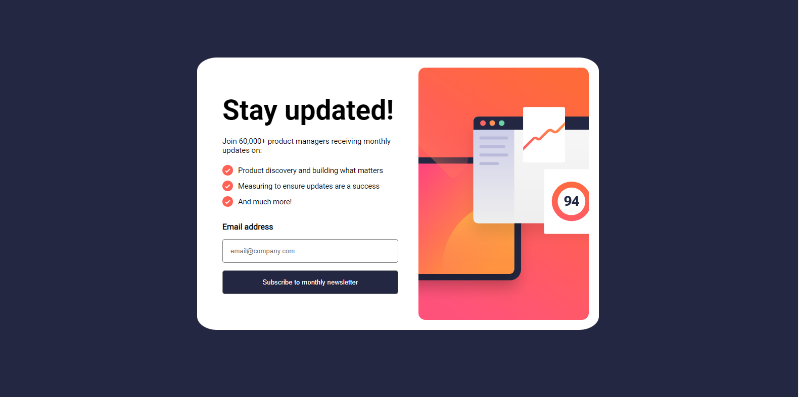

# Frontend Mentor - Newsletter sign-up form with success message solution

This is a solution to the [Newsletter sign-up form with success message challenge on Frontend Mentor](https://www.frontendmentor.io/challenges/newsletter-signup-form-with-success-message-3FC1AZbNrv). Frontend Mentor challenges help you improve your coding skills by building realistic projects. 

## Table of contents

- [Overview](#overview)
  - [The challenge](#the-challenge)
  - [Screenshot](#screenshot)
  - [Links](#links)
- [My process](#my-process)
  - [Built with](#built-with)
  - [What I learned](#what-i-learned)
  - [Continued development](#continued-development)
- [Author](#author)

## Overview

### The challenge

Users should be able to:

- Add their email and submit the form
- See a success message with their email after successfully submitting the form
- See form validation messages if:
  - The field is left empty
  - The email address is not formatted correctly
- View the optimal layout for the interface depending on their device's screen size
- See hover and focus states for all interactive elements on the page

### Screenshot



### Links

- Solution URL: [Solution URL here](https://github.com/Samuellekpor/newsletter-signup)
- Live Site URL: [Live site URL here](https://samuellekpor.github.io/newsletter-signup/)

## My process

### Built with

- Semantic HTML5 markup
- CSS custom properties
- Flexbox
- JavaScript

### What I learned

- Media queries helped me design the mobile and desktop versions of the website

```css
  @media( max-width: 768px) {
    ...
  }
```

- What really marked me during this project was the functionality of the submit button. It didn't work first because the declaration of the entered email was coming before the user clicks on the button. Only debugging wit console.log() helped me find out that the variable was not being gotten. Everything worked fine when I put the enteredEmail variable declaration inside the click event on the submit button.

### Continued development

- Debugging with console.log() is great because it helps you know if a variable is being accessed or not.
- Debugging JS code with the chrome debugger

## Author

- Website - [Add your name here](https://www.your-site.com)
- Frontend Mentor - [@yourusername](https://www.frontendmentor.io/profile/yourusername)
- Twitter - [@yourusername](https://www.twitter.com/yourusername)
